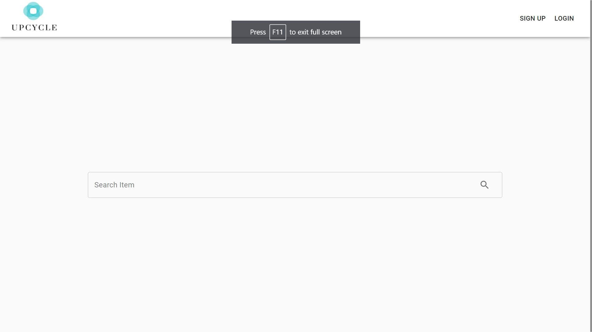
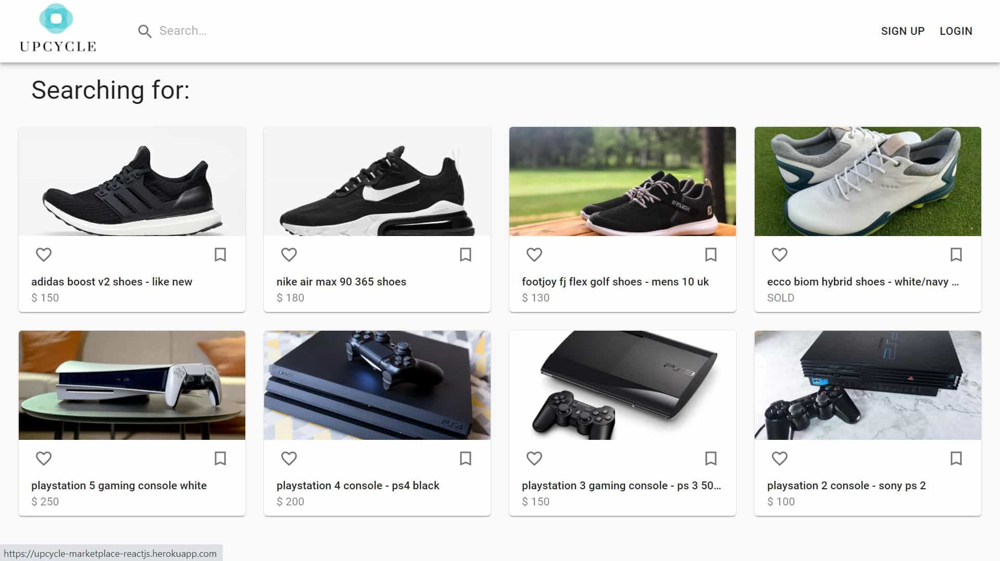
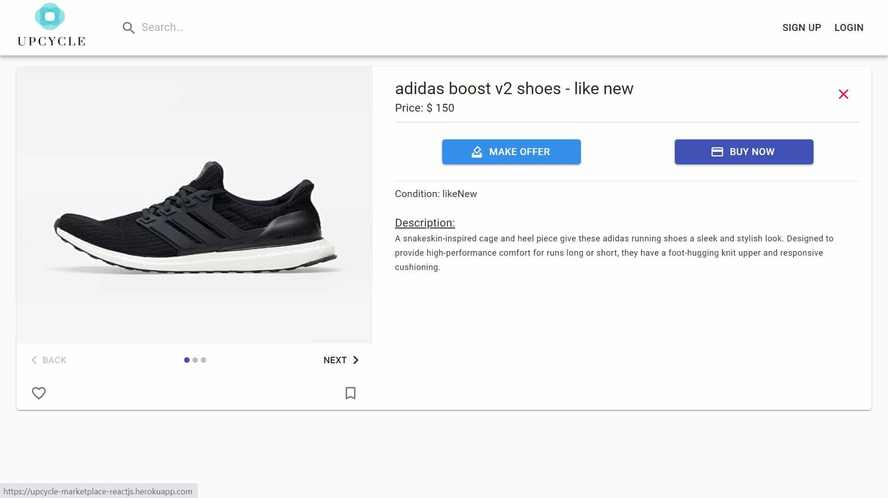
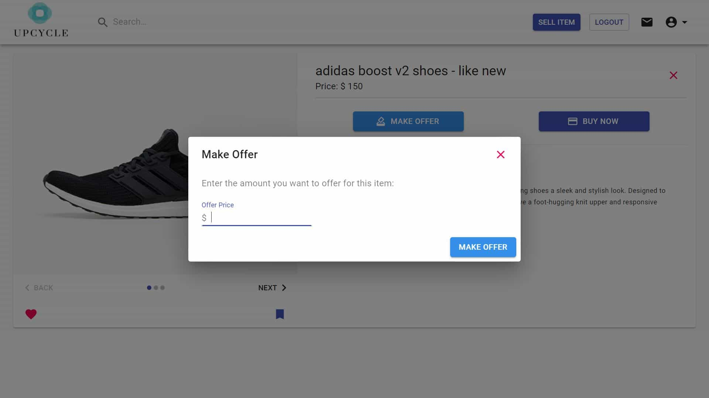
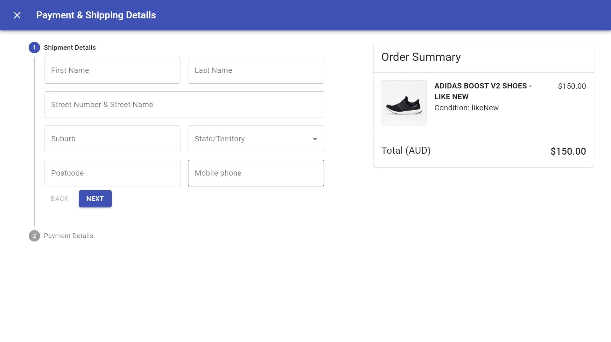
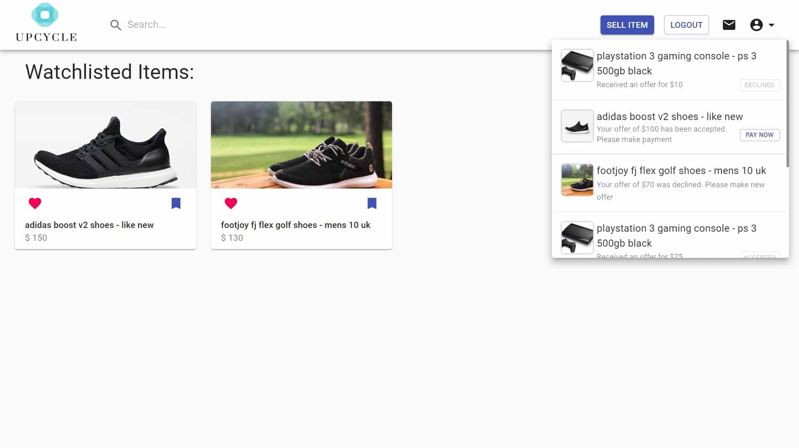

# Upcycle Marketplace

## Overview

---

This is a final project of the coding bootcamp where user created a Web Application using the MERN Stack (MongoDB, Express.js, React.js and Node.js). The concept is to create user friendly, intuitive and minimalistic marketplace web app where user can buy and sell their second hand items with a single click of a button.

## Table of Contents

---

- [Version History](#version-history)
- [How It Works](#how-it-works)

- [Links](#links)
- [License](#license)
- [Acknowledgements](#acknowledgements)

## Version History

---

- Version 0.0 - 12 May 2021
  Initial working React Front End & Express server back end

## How It Works

---

1. Click the following [Link](https://upcycle-marketplace-reactjs.herokuapp.com/) to go to the deployed web app on heroku. Note: due to hosting on heroku, initial load time will be a bit slow.

2. User will be taken to the home or landing page with a simple search bar in the center of the page. To search for all items available, just click on the search bar, and without any input just press enter or click the search icon. This will show all items posted.

3. User then can click to view the item in more details, where user can decide to make an offer or buy the item now. User must be logged in to do this. If user does not have an account, they can sign up by clicking the sign up button on the navigation bar.

4. When user click on the "Make Offer" button, a modal will show up where user can then enter the amount to offer. Conversely, the "Buy Now" button also will open a modal with stepper where user are prompted to enter their shipment & payment details to purchase the item directly.

5. Any user actions on a posted item, whether make offer or buy now, this will trigger a notification response which can be view by clicking the "Message Icon" once the user has login.

## Links

---

- [ GitHub Source Code](https://github.com/vsumargo/Upcycle-Marketplace-React.Js)

- [Upcycle Marketplace](https://upcycle-marketplace-reactjs.herokuapp.com)

## License

---

License under the MIT license

## Acknowledgements

---

- **Trilogy Education Services & UWA Coding Bootcamp**

- **Luca & Sam** - for their time in teaching the coding bootcamp course.
